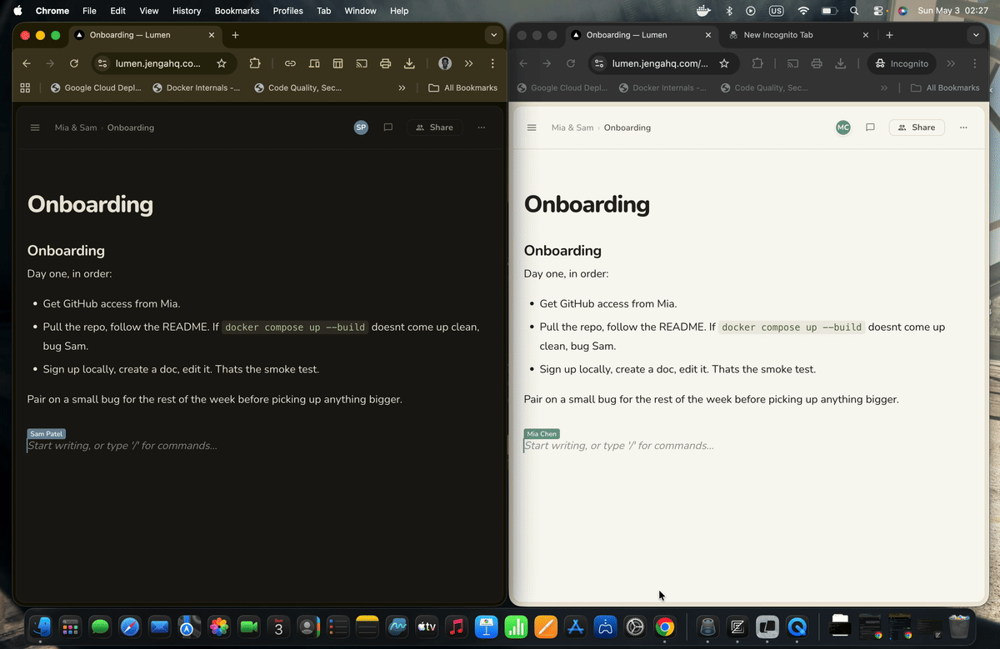
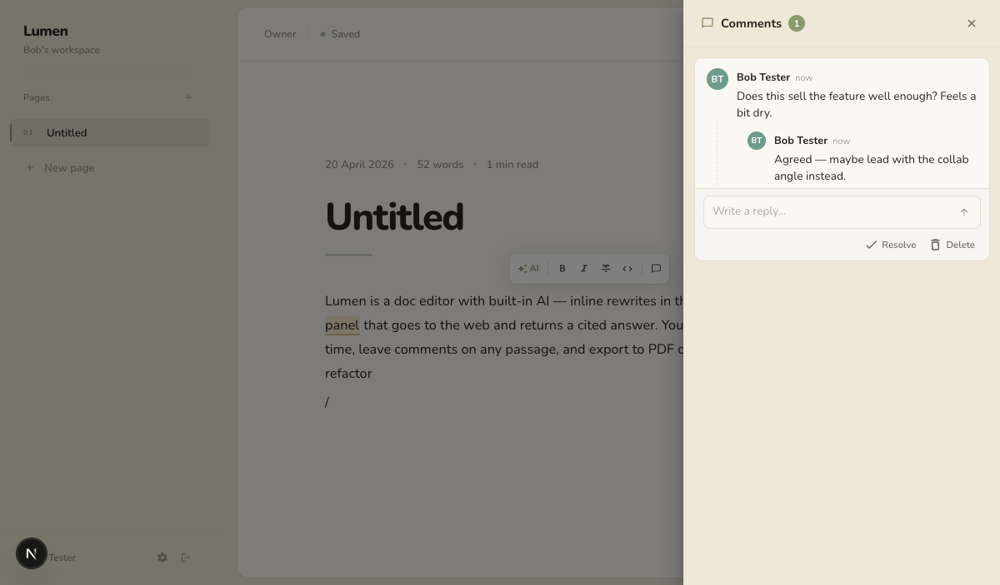
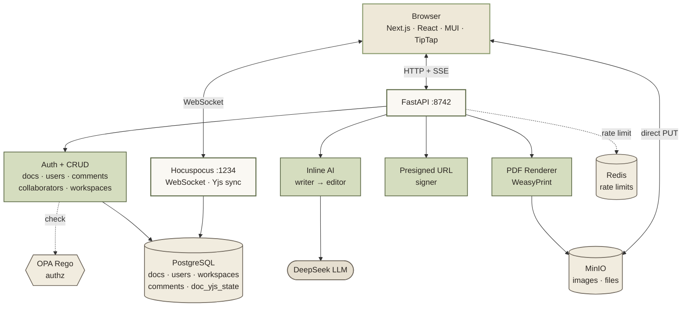
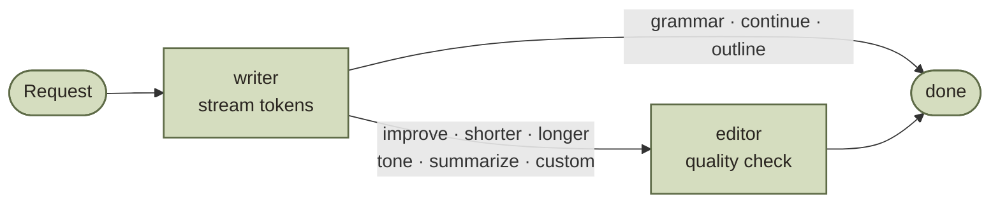

# Lumen

A self-hosted document editor with real-time collaboration and inline AI. Think Google Docs with a writing assistant, runs on your hardware.

**Live demo:** [lumen.jengahq.com](https://lumen.jengahq.com). Feel free to poke around. Don't store anything you can't lose.





## Features

**Rich-text editor.** Headings, lists, quotes, code blocks with syntax highlighting (40+ languages via lowlight), tables with drag-to-resize, image upload, and a slash menu for fast block insertion.

**Nested pages.** Any page can hold child pages. The sidebar shows the tree with chevron expand/collapse and auto-expands ancestors of the current page. Hover a row to add a subpage or open the menu (move to top level, delete subtree). Cycle moves are rejected server-side via a recursive CTE; deletions cascade.


**Real-time collaboration.** Multiple people can edit the same doc with Yjs CRDTs; edits merge without conflicts and survive offline. Live cursors show where everyone is, a presence avatar stack shows who's in the doc, and a share popover grants access as editor or viewer, or opens it up to the whole workspace.

**Inline AI.** Select text, hit AI in the bubble menu, pick Improve / Shorter / Longer / Grammar / Tone / Summarize, or type a custom instruction. On empty lines, type `/` and pick Ask AI to Continue writing or Write outline. Responses stream token-by-token. Replace, Insert below, Try again, or Discard.

**Threaded comments.** Highlight any passage and leave a comment. Replies thread under the first message, threads can be resolved or reopened, and the highlight travels with the text as edits happen. It's a TipTap mark synced through Yjs, not a brittle character-offset anchor.

**Diagrams.** Mermaid and PlantUML render inline; type the source, see the diagram. Rendered via a self-hosted Kroki container so no third-party calls.

**Fact-check.** Highlight a paragraph, run fact-check; the backend extracts claims, queries Serper, and streams a verdict per claim back to the editor as decorations.

**Export.** Download the current doc as Markdown (client-side via turndown) or PDF (server-side via WeasyPrint, with internal MinIO URLs rewritten automatically).

**Image uploads.** Paste, drop, or pick from the slash menu. Files go straight from the browser to MinIO via a presigned PUT URL; the backend only signs, never handles bytes.

**Auth & access.** Email/password with bcrypt and a short-lived JWT in an httpOnly cookie. OPA Rego enforces per-doc access. Docs are workspace-visible by default, can be flipped private (owner + invited collaborators only). Workspace invites are copy-link with role.

**Observability.** OpenTelemetry auto-instruments every request, DB query, and outgoing HTTP call; the browser SDK adds session replay, console capture, and uncaught exceptions. Both correlate by `trace_id`. Bundled target: `docker compose --profile observability up -d hyperdx` → http://localhost:8080 → Team Settings → Integrations → copy the Ingestion API Key into `.env`.

**Mobile + dark mode.** Mobile collapses the sidebar into a drawer; the share button becomes icon-only; popovers size to the viewport. Dark mode is real, not an afterthought.

## Architecture



The Hocuspocus collab server keeps a Yjs state blob in Postgres (`doc_yjs_state`) so it survives restarts and late joiners get the right state.

### Inline AI



The writer streams tokens from DeepSeek using an action-specific prompt. For actions where quality matters (improve, shorter, longer, tone, summarize, custom), an editor node runs after with its own LLM call, returns a JSON verdict, and emits a revision event only if it actually changed anything. Grammar, continue, and outline skip the editor because a second pass adds no value.

### Comments

Highlighted passages are wrapped in a custom TipTap mark (`<span data-thread-id="...">`). Because marks are part of the ProseMirror schema, Yjs serializes them along with everything else, so the highlight moves with the text as others edit around it. The thread content (author, body, replies, resolved state) lives in Postgres keyed on `thread_id`. Deleting a thread strips the mark from the doc via a diff against the previous thread list, so highlights don't linger.

## Running it

You need Docker and a DeepSeek API key.

```bash
cp .env.example .env
# set POSTGRES_PASSWORD, SECRET_KEY (32+ chars),
# MINIO_ROOT_USER, MINIO_ROOT_PASSWORD, MINIO_BUCKET
docker compose up --build
```

Open http://localhost:3847 and sign up. After signup, visit **Settings → API Keys** and paste your DeepSeek key. AI actions return a "Configure AI in Settings" prompt until a key is configured.

DeepSeek is the default; any OpenAI-compatible endpoint works. Each user configures their own key in Settings → API Keys (encrypted at rest). Workspace admins can also set a shared key that other members fall back to.

### Environment

```
SECRET_KEY                  openssl rand -base64 32 (32+ chars)
POSTGRES_PASSWORD           anything
DATABASE_URL                postgresql://postgres:<pw>@postgres:5432/app

DEEPSEEK_API_KEY            optional bootstrap; users can also set their own
DEEPSEEK_BASE_URL           https://api.deepseek.com
DEEPSEEK_MODEL              deepseek-chat

MINIO_ROOT_USER             minioadmin
MINIO_ROOT_PASSWORD         changeme
MINIO_BUCKET                lumen-uploads

NEXT_PUBLIC_COLLAB_URL      ws://localhost:1234   (wss://${DOMAIN}/collab in prod)
REDIS_URL                   redis://redis:6379/0  (in-memory fallback if absent)

SITE_URL                    https://your.domain   (required in prod; used in invite links)

SERPER_API_KEY              optional; enables fact-check via serper.dev

# Observability. Wire to HyperDX (self-hosted or cloud).
OTEL_EXPORTER_OTLP_ENDPOINT
OTEL_EXPORTER_OTLP_HEADERS  authorization=<ingestion-key>
NEXT_PUBLIC_HYPERDX_API_KEY
NEXT_PUBLIC_HYPERDX_URL     http://localhost:4318  (only for self-hosted)
```

### Ports

| Service | Port | Purpose |
|---------|------|---------|
| `web` | 3847 | Next.js frontend |
| `research-api` | 8742 | FastAPI backend |
| `collab` | 1234 | Hocuspocus WebSocket (Yjs sync) |
| `postgres` | 5434 | Database |
| `minio` | 9000, 9001 | Object store (API + console) |
| `opa` | 8181 | Policy evaluation |
| `redis` | 6379 | Rate limit counters |

### Without Docker

```bash
# Backend
cd apps/backend
python -m venv .venv && source .venv/bin/activate
pip install -r requirements.txt
ENV_FILE=../../.env uvicorn app.main:app --reload --port 8742

# Frontend (in another terminal)
cd apps/web
npm install && npm run dev
```

You still need Postgres, MinIO, and the collab service running somewhere; easiest is `docker compose up postgres minio minio-init collab opa`.

### Deploy

Production target is a single VM with `docker-compose.prod.yml` + Caddy for auto-HTTPS. The included compose builds `web` with `NEXT_PUBLIC_*` baked in at build time (Next.js inlines them), so any change to those vars needs `docker compose -f docker-compose.prod.yml up -d --build web` to take effect.

### Lint

```bash
cd apps/backend && ruff check . && ruff format .
cd apps/web && npm run lint && npm run build
```

## API

Everything lives under `/api/v1/`. Auth is a session cookie set by the login endpoint.

```
POST   /api/v1/auth/signup
POST   /api/v1/auth/login
POST   /api/v1/auth/logout
GET    /api/v1/auth/me
GET    /api/v1/auth/ws-token                       short-lived token for Hocuspocus

POST   /api/v1/ai/inline                           SSE stream (writer + editor)
GET    /api/v1/ai/summarize/:docId                 SSE stream. short / medium / long

GET    /api/v1/workspaces
POST   /api/v1/workspaces
PATCH  /api/v1/w/:slug                             rename (admin only)
GET    /api/v1/w/:slug/members
PATCH  /api/v1/w/:slug/members/:userId             change role (admin only)
DELETE /api/v1/w/:slug/members/:userId             remove or leave
POST   /api/v1/w/:slug/invites                     mint copy-link invite (admin only)
GET    /api/v1/w/:slug/invites                     list outstanding (admin only)
DELETE /api/v1/w/:slug/invites/:token              revoke (admin only)
GET    /api/v1/invites/:token                      public preview
POST   /api/v1/invites/:token/accept               logged-in user joins
POST   /api/v1/invites/:token/signup               new user signs up + joins

GET    /api/v1/content/docs
POST   /api/v1/content/docs                        body may include parent_id
GET    /api/v1/content/docs/:id
PATCH  /api/v1/content/docs/:id
DELETE /api/v1/content/docs/:id                    cascade-deletes the subtree
PATCH  /api/v1/content/docs/:id/visibility         private | workspace
PATCH  /api/v1/content/docs/:id/move               { parent_id }. owner only, cycle-checked
GET    /api/v1/content/docs/:id/export/pdf

POST   /api/v1/content/docs/:id/collaborators
PATCH  /api/v1/content/docs/:id/collaborators/:userId
DELETE /api/v1/content/docs/:id/collaborators/:userId

GET    /api/v1/content/docs/:id/comments
POST   /api/v1/content/docs/:id/comments           create thread with first message
POST   /api/v1/content/comments/:threadId/messages reply
PATCH  /api/v1/content/comments/:threadId          { resolved: bool }
DELETE /api/v1/content/comments/:threadId          creator only

GET    /api/v1/content/collaborators/my
DELETE /api/v1/content/collaborators/:userId       bulk remove across all docs

POST   /api/v1/uploads/presign                     { content_type, kind } → PUT URL + public URL

GET    /api/v1/settings/profile
PATCH  /api/v1/settings/profile
POST   /api/v1/settings/password
GET    /api/v1/settings/credentials
PUT    /api/v1/settings/credentials/user
DELETE /api/v1/settings/credentials/user
PUT    /api/v1/settings/credentials/workspace      admin only
DELETE /api/v1/settings/credentials/workspace      admin only

GET    /api/v1/users/search?email=
```

AI endpoints are rate-limited at 20 requests/minute and 300 requests/hour per user. Counters live in Redis with a fixed-window scheme (`rate:{user_id}:m:{minute}`); an in-memory fallback kicks in if Redis is unreachable so a Redis outage doesn't block AI. Signup is rate-limited to 2/min and 5/hour per IP.

## Layout

```
apps/
  backend/
    app/
      agents/inline/     writer, editor, graph, prompts, state, llm_client
      db/                asyncpg layer - docs, comments, users, workspaces, credentials
      middleware/        auth, opa, ratelimit
      migrations/        SQL, numbered, run on app startup
      routers/           ai, auth, comments, docs, invites, settings, uploads, users, workspaces
      services/          pdf (WeasyPrint), crypto, llm_resolver
      main.py
  collab/
    src/server.ts        Hocuspocus, loads/saves Yjs state to Postgres
  web/
    src/
      app/
        (auth)/                       login, signup
        api/backend/                  proxy to FastAPI
        settings/                     profile, api-keys, people, appearance
        w/[slug]/
          docs/
            layout.tsx                client shell - sidebar persists across nav
            [id]/
              page.tsx                editor page
              _components/            colocated docs UI: editor extensions,
                                      comments, AI panel, share, sidebar tree…
          settings/members/           workspace members + invites
        _landing/                     landing page sections
      hooks/                          useCurrentUser, useWorkspaces (cross-route)
      lib/                            api.ts, types.ts, hyperdx.ts
packages/
  ui/                                 @repo/ui - FormInput, FormSelect, menuPaperSx
  tsconfig/                           shared TS configs
policies/                             OPA Rego
docker-compose.yml                    postgres · opa · redis · research-api · collab
                                      · minio · web · kroki · (hyperdx, profile)
docker-compose.prod.yml               same with Caddy + DOMAIN-bound TLS
```

The `_components/` colocation is intentional: each page owns its own UI, hooks, and lib helpers. Only genuinely cross-route modules live in `src/hooks/`, `src/lib/`, or `@repo/ui`.

## Stack

DeepSeek for LLM calls, LangGraph for the inline-AI writer/editor graph, FastAPI with asyncpg and SSE streaming on the backend, Hocuspocus + Yjs for the collab server, Next.js 16 App Router with React 19 and Material UI 7 on the frontend, TipTap v3 for the editor, lowlight + highlight.js for syntax colors, marked + DOMPurify for the markdown-to-ProseMirror pipeline, WeasyPrint for PDF, Kroki for diagram rendering, MinIO for object storage, Redis for rate-limit counters, PostgreSQL, OPA Rego for authorization, OpenTelemetry → HyperDX for traces / logs / session replay, Turborepo, Docker.

## License

MIT. Issues and PRs welcome.
