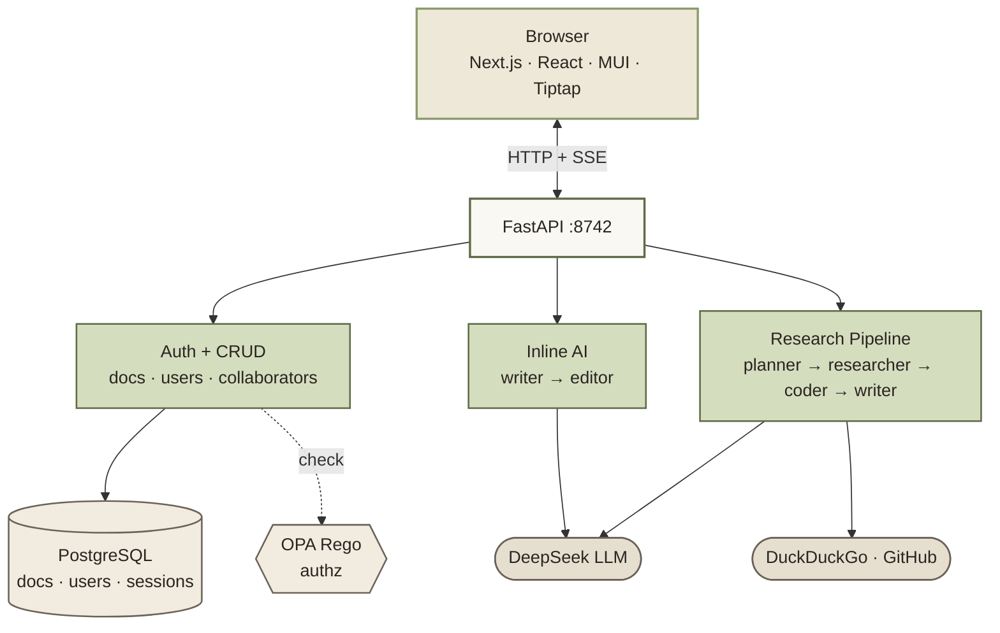
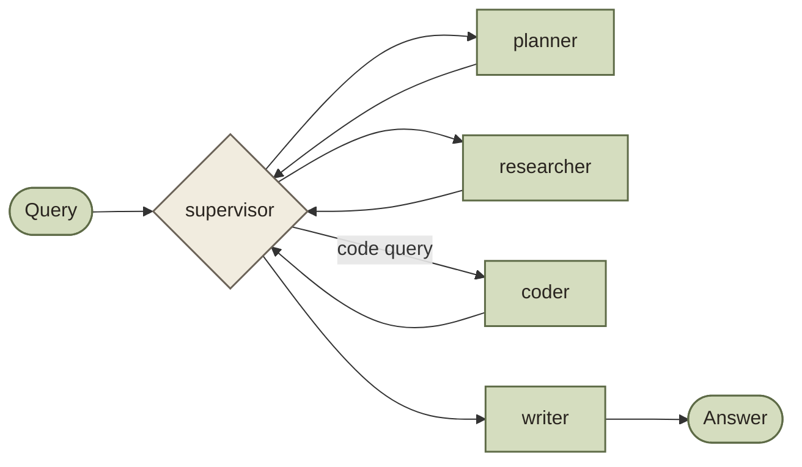

# Lumen

A document editor with two AI systems wired in: inline rewrites and generation in the bubble/slash menu, and a separate research panel that goes to the web and returns a cited answer.

## Features

Rich-text editor with headings, lists, quotes, and code blocks (40+ languages, GitHub syntax colors, a searchable language picker, and a copy button).

Inline AI. Select text, click AI in the bubble menu, pick Improve / Shorter / Longer / Grammar / Tone / Summarize, or type a custom instruction. Or on an empty line type `/` and pick Ask AI to Continue writing or Write outline. Responses stream and you can Replace, Insert below, Try again, or Discard.

Research panel. A drawer you open with the sparkle button or `⌘K`. It runs a four-agent LangGraph pipeline (planner, researcher, coder, writer) over DuckDuckGo and GitHub and returns markdown with inline citations.

Collaboration. Share docs with people in your workspace as editor or viewer. Access is enforced by an OPA Rego policy.

Auth. Email and password, bcrypt, JWT session cookie. No external OIDC provider.

Everything works in dark mode.

## Architecture



Inline AI and the research pipeline share the DeepSeek client and nothing else. Inline AI is a two-node graph optimised for sub-two-second latency and runs without web tools. The research pipeline is a four-agent supervisor graph that takes ten to thirty seconds and pulls in sources from the web.

### Inline AI


The writer streams tokens from DeepSeek using an action-specific prompt. For actions where quality control matters (improve, shorter, longer, tone, summarize, custom), an editor node runs after with its own LLM call, returns a JSON verdict, and emits a revision event only if it actually changed anything. Grammar, continue, and outline skip the editor because a second pass adds no value.

Adding a fact-checker later is one conditional edge on the graph.

### Research pipeline



The supervisor reads shared state and routes to the next node deterministically. It skips the coder for non-code queries, retries the researcher if results are thin, and never calls an LLM to decide what to do next.

## Running it

You need Docker, a DeepSeek API key, and optionally a GitHub token (raises the code search rate limit from 60 to 5000 per hour).

```bash
cp .env.example .env
# set POSTGRES_PASSWORD and SECRET_KEY (32+ chars)
docker compose up --build
```

Open http://localhost:3847 and sign up. After signup, visit **Settings → API Keys** and paste your DeepSeek key — AI actions return a "Configure AI in Settings" prompt until a key is configured.

### Environment

```
DEEPSEEK_BASE_URL      https://api.deepseek.com
DEEPSEEK_MODEL         deepseek-chat
GITHUB_TOKEN           optional
SECRET_KEY             openssl rand -base64 32 (32+ chars required)
POSTGRES_PASSWORD      anything
DATABASE_URL           postgresql://postgres:<pw>@postgres:5432/app
```

DeepSeek API keys live in the database, not env. Each user configures their own in Settings → API Keys (encrypted at rest). Workspace admins can also set a shared key that other members use as a fallback.

### Ports

Frontend on 3847, backend on 8742, Postgres on 5434, OPA on 8181.

### Without Docker

```bash
cd apps/backend
python -m venv .venv && source .venv/bin/activate
pip install -r requirements.txt
ENV_FILE=../../.env uvicorn app.main:app --reload --port 8742
```

```bash
cd apps/web
npm install
npm run dev
```

Or from the root with Turborepo: `npm install && npm run dev`.

### Tests and lint

```bash
cd apps/backend && pytest -v
cd apps/backend && ruff check . && ruff format .
cd apps/web && npm run lint
cd apps/web && npm run build
```

## API

Everything lives under `/api/v1/`. Auth is a session cookie set by the login endpoint.

```
POST   /api/v1/auth/signup
POST   /api/v1/auth/login
POST   /api/v1/auth/logout
GET    /api/v1/auth/me

POST   /api/v1/ai/inline               SSE stream (writer + editor)

POST   /api/v1/research                JSON response
POST   /api/v1/research/stream         SSE stream per agent

GET    /api/v1/sessions
GET    /api/v1/sessions/:id
DELETE /api/v1/sessions/:id

GET    /api/v1/content/docs
POST   /api/v1/content/docs
GET    /api/v1/content/docs/:id
PATCH  /api/v1/content/docs/:id
DELETE /api/v1/content/docs/:id
GET    /api/v1/content/docs/:id/collaborators
POST   /api/v1/content/docs/:id/collaborators
DELETE /api/v1/content/docs/:id/collaborators/:userId

GET    /api/v1/content/collaborators/my
DELETE /api/v1/content/collaborators/:userId

GET    /api/v1/settings/profile
PATCH  /api/v1/settings/profile
POST   /api/v1/settings/password
GET    /api/v1/settings/credentials
PUT    /api/v1/settings/credentials/user
DELETE /api/v1/settings/credentials/user
PUT    /api/v1/settings/credentials/workspace    (admin)
DELETE /api/v1/settings/credentials/workspace    (admin)

GET    /api/v1/users/search?email=
```

Inline AI request body:

```json
{
  "action": "improve",
  "tone": "casual",
  "prompt": "make this sassier",
  "selection": "the highlighted text",
  "context": "surrounding paragraphs",
  "topic": "outline topic"
}
```

`action` is one of `improve`, `shorter`, `longer`, `grammar`, `tone`, `summarize`, `continue`, `outline`, `custom`. The other fields are conditional on the action. The SSE stream emits `status`, then repeated `token`, then `draft_complete`, then (if the editor pass ran) `status` and optionally `revision`, then `done`.

## Layout

```
apps/
  backend/
    app/
      agents/
        inline/          writer, editor, graph, prompts, state, llm_client
        planner.py
        researcher.py
        coder.py
        writer.py
        supervisor.py
      db/                asyncpg layer
      middleware/        auth, opa
      migrations/
      models/
      routers/           ai, auth, docs, sessions, users
      tools/             web_search, doc_reader, github_search
      graph.py           research supervisor graph
      main.py
    tests/
  web/
    src/
      app/
        (auth)/          login, signup
        api/backend/     proxy to FastAPI
        docs/[id]/       editor page
        layout.tsx
        providers.tsx
        globals.css
      components/
        docs/
          ai/            AIPanel, PresetList, PromptInput,
                         ToneSubmenu, StreamingPreview, PreviewActions
          CodeBlock.tsx
          DocEditor.tsx
          DocSidebar.tsx
          DocResearchPanel.tsx
          CollaboratorList.tsx
          ShareButton.tsx
        chat/            ChatInput, MessageBubble, MessageList
        layout/          Header, ThemeToggle
        shared/          FormInput, FormSelect
      hooks/             useInlineAI, useChat, useDoc, useDocs,
                         useCurrentUser, useSessions
      lib/
        api.ts
        editor-context.ts
        markdown.ts
        types.ts
policies/                OPA Rego
docker-compose.yml
```

## Stack

DeepSeek for the LLM calls, LangGraph for agent orchestration, FastAPI with asyncpg and SSE streaming on the backend, Next.js 16 App Router with React 19 and Material UI 7 on the frontend, Tiptap v3 for the editor, lowlight with highlight.js for syntax colors, marked and DOMPurify for the markdown-to-ProseMirror pipeline, PostgreSQL, OPA for authorization, Turborepo, Docker.

## License

MIT
